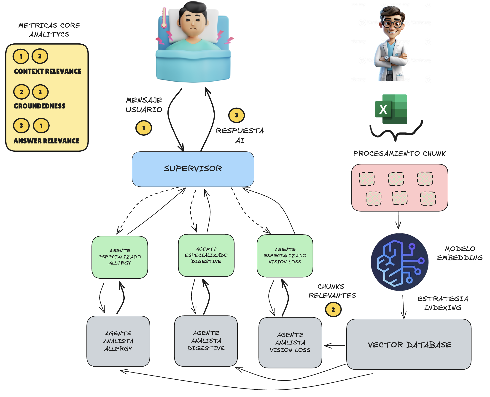

# AI Medical Assitant

POC:
This is a project related to a medical assistant chatbot powered by AI and Multi-Agents



# Settings

```
add a .env file
inside add your OPENAI_API_KEY = "......"
```

```
python3.10 -m venv venv
source venv/bin/activate (just for Mac)
pip install -r requirements.txt
```

# Run project with

```
streamlit run app.py
```
